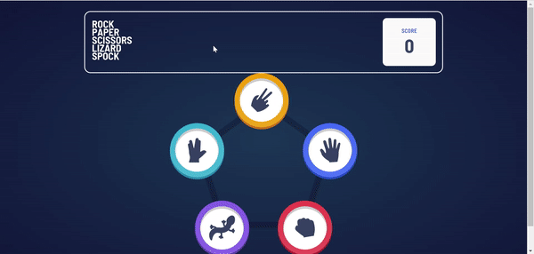
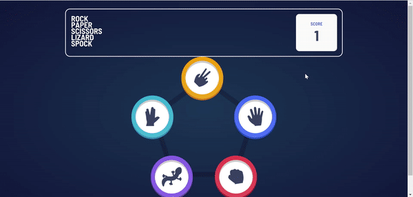

# Frontend Mentor - Rock, Paper, Scissors, Lizard, Spock solution

This is a solution to the [Rock, Paper, Scissors, Lizard, Spock challenge on Frontend Mentor](https://www.frontendmentor.io/challenges/rock-paper-scissors-game-pTgwgvgH). Frontend Mentor challenges help you improve your coding skills by building realistic projects.

## Table of contents

- [Frontend Mentor - Rock, Paper, Scissors, Lizard, Spock solution](#frontend-mentor---rock-paper-scissors-lizard-spock-solution)
  - [Table of contents](#table-of-contents)
  - [Overview](#overview)
    - [The challenge](#the-challenge)
    - [Animated Gifs](#animated-gifs)
    - [Links](#links)
  - [My process](#my-process)
    - [Built with](#built-with)
    - [Continued development](#continued-development)
  - [Author](#author)

## Overview

### The challenge

Users should be able to:

- View the optimal layout for the game depending on their device's screen size
- Maintain the state of the score after refreshing the browser
- Play Rock, Paper, Scissors, Lizard, Spock against the computer

### Animated Gifs

- Desktop Version

  - 

- Mobile Version
  - 

### Links

- Solution URL: [https://www.frontendmentor.io/solutions/challenge-made-with-react-and-styledcomponents-HJe5Jtevc](https://www.frontendmentor.io/solutions/challenge-made-with-react-and-styledcomponents-HJe5Jtevc)
- Live Site URL: [https://Wildmarks-Passos.github.io/pedra-papel-tesoura-lagarto-spock](https://Wildmarks-Passos.github.io/pedra-papel-tesoura-lagarto-spock)

## My process

### Built with

- Semantic HTML5 markup
- CSS custom properties
- Flexbox
- CSS Grid
- Data Persistence
- [React](https://reactjs.org/) - JS library
  - Conditional Rendering
- [Styled Components](https://styled-components.com/) - For styles
  - Conditional Style

### Continued development

I intend to improve my knowledge using Typescript in the next projects.

## Author

- Frontend Mentor - [@Wildmarks-Passos](https://www.frontendmentor.io/profile/Wildmarks-Passos)
- Linkedin - [@Wildmarks-Passos](https://www.linkedin.com/in/wildmarks-passos/)
